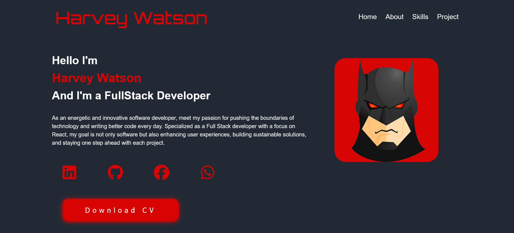

# 🚀 Portfolio Website

A professional portfolio website showcasing my work as a Full Stack Developer, built with modern design principles and responsive architecture.

## 🌐 Live Demo

**[View Live Website](https://elif-yuzer.github.io/portfolio-html-css/)**

### Demo Preview



---

## 📋 Table of Contents

- [Features](#features)
- [Technologies](#technologies)
- [Installation](#installation)
- [File Structure](#file-structure)
- [Sections](#sections)
- [Responsive Design](#responsive-design)
- [Social Media Links](#social-media-links)
- [License](#license)

---

## ✨ Features

- ⚡ **Modern & Fast** - Optimized performance
- 📱 **Fully Responsive** - Mobile, tablet, and desktop compatible
- 🎨 **Sleek Design** - Red and dark theme combination
- 🔤 **Professional Typography** - Orbitron, IBM Plex Mono, Comfortaa fonts
- 🎭 **Smooth Animations** - Transition effects and hover interactions
- ♿ **Accessible** - Semantic HTML structure

---

## 🛠️ Technologies

- **HTML5** - Semantic structure
- **CSS3** - Grid, Flexbox, Animations
- **Font Awesome 7.0.1** - Icons
- **Google Fonts** - Professional typography

```
Technology Stack:
├── Frontend
│   ├── HTML5
│   ├── CSS3 (Grid & Flexbox)
│   └── Font Awesome Icons
├── Fonts
│   ├── Orbitron (Headings)
│   ├── IBM Plex Mono (Body Text)
│   └── Comfortaa (Headings)
```

---

## 📦 Installation

### 1. Clone the Repository
```bash
git clone https://github.com/elif-yuzer/portfolio-html-css.git
cd portfolio-html-css
```

### 2. Dependencies
No external dependencies required. Only an internet connection is needed (for Google Fonts and Font Awesome CDN).

---

## 📁 File Structure

```
portfolio/
├── index.html          # Main HTML file
├── style.css          # CSS styles
├── images/
│   ├── harvey.png     # Profile photo
│   ├── projects1.jpg  # Project image
│   ├── projects2.jpg  # Project image
│   └── projects3.jpg  # Project image
└── README.md          # This file
```

---

## 📄 Sections

### 🏠 Home
- Personal introduction
- Professional title and description
- Social media links
- CV download button
- Animated profile picture

### 👤 About
- Detailed biography
- Areas of expertise
- Mission and vision
- Educational goals

### 🎯 Skills
- 6 main technology areas
  - HTML
  - CSS
  - React
  - Node.js
  - SASS
  - Bootstrap
- Interactive skill cards with hover effects
- Detailed descriptions

### 🎨 Projects
- 8 different project categories
- Grid layout with images
- Title overlay on hover
- Project links

### 📞 Footer
- Copyright information
- Back to top button

---

## 📱 Responsive Design

The site is optimized for three breakpoints:

| Device | Width | Features |
|--------|-------|----------|
| **Desktop** | > 1024px | 2-column grid, wide padding |
| **Tablet** | 769px - 1024px | Flexible layout, medium padding |
| **Mobile** | < 500px | 1-column layout, minimal padding |

```css
/* Breakpoints */
@media (max-width: 1024px) { /* Tablet */ }
@media (max-width: 500px) { /* Mobile */ }
```

---

## 🔗 Social Media Links

Add your social media URLs in the Home and Footer sections:

```html
<a href="https://linkedin.com/in/username" target="_blank">
  <i class="fa-brands fa-linkedin"></i>
</a>
```

Supported platforms:
- LinkedIn
- GitHub
- Facebook
- WhatsApp

---

## 🎨 Color Scheme

```css
Primary Color (Red): #d80404
Background Color: #212a34
Secondary Background: #353f4e
Text Color: #ffffff
```

---

## ⚙️ Customization

### Change Colors
```css
:root {
  --main-color: #d80404;        /* Change red */
  --bg-color: #212a34;          /* Change background */
  --text-color: #fff;           /* Change text color */
}
```

### Change Fonts
Select your preferred font from Google Fonts and update the CSS imports.

### Font Sizes
Fluid typography is used throughout:
```css
--fs-16: clamp(0.75rem, 0.662rem + 0.3756vw, 1rem);
```

---

## 🚀 Deployment

### Live Website
**[https://elif-yuzer.github.io/portfolio-html-css/](https://elif-yuzer.github.io/portfolio-html-css/)**

### GitHub Repository
**[https://github.com/elif-yuzer/portfolio-html-css](https://github.com/elif-yuzer/portfolio-html-css)**

### GitHub Pages
1. Go to repository settings
2. Enable GitHub Pages
3. Select `main` branch
4. Automatically published

### Netlify
```bash
# Deploy with Netlify CLI
netlify deploy --prod
```

### Vercel
```bash
# Deploy with Vercel CLI
vercel --prod
```

---

## 📋 Checklist

To complete the project:

- [ ] Update social media links
- [ ] Add CV file for download
- [ ] Upload profile and project images
- [ ] Add contact information
- [ ] Update project links
- [ ] Optimize meta tags (SEO)
- [ ] Add Google Analytics
- [ ] Add favicon

---

## 🐛 Troubleshooting

### Images not loading
- Ensure the `images/` folder and files exist
- Check file paths

### Fonts not loading
- Check your internet connection
- Verify Google Fonts CDN is accessible

### Responsive design not working
- Clear browser cache
- Check viewport settings in Developer Tools

---

## 📈 SEO Optimization

Recommendations for better search engine ranking:

```html
<meta name="description" content="Harvey Watson - Full Stack Developer Portfolio">
<meta name="keywords" content="react, nodejs, developer, portfolio">
<meta name="author" content="Harvey Watson">
<meta property="og:title" content="Harvey Watson Portfolio">
```

---

## 📞 Contact

- **Email**: example@example.com
- **LinkedIn**: [Harvey Watson](#)
- **GitHub**: [username](#)

---

## 📄 License

This project is licensed under the MIT License. See the [LICENSE](LICENSE) file for details.

---

## 🙏 Acknowledgments

- [Font Awesome](https://fontawesome.com/) - Icons
- [Google Fonts](https://fonts.google.com/) - Typography
- [CDNJS](https://cdnjs.cloudflare.com/) - CDN service

---

## 📊 Project Statistics

```
Files: 3 (HTML, CSS, README)
Lines of Code: 500+
Responsive Breakpoints: 3
Supported Browsers: All modern browsers
Performance: Optimized and fast-loading
```

---

**⭐ If you like this project, please give it a star!**

Follow for updates and improvements.